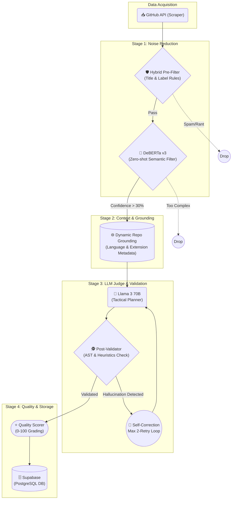

# GitNova 🚀

> **Stop searching. Start contributing.**  
> An autonomous AI-powered engine that hunts for beginner-friendly Open Source issues so you don't have to.

 

## ⚡ The Problem: Analysis Paralysis
Most developers fail at Open Source because they get stuck trying to find an issue among thousands, only to realize the issue is either too hard, lacks context, or is actually a sprawling architecture proposal. 

**GitNova** solves this by automating the hunt. It continuously scans GitHub, filters out the noise using **Hybrid Heuristics + DeBERTa v3**, and utilizes **Llama 3** to generate highly accurate, repo-grounded tactical solutions.

**🔴 Live Demo:** [gitnova-dev.vercel.app](https://gitnova-dev.vercel.app)

---

## 🏗️ The 6-Stage AI Pipeline
GitNova operates a resilient, self-correcting 6-stage data pipeline orchestrated via GitHub Actions. It processes thousands of raw issues and distills them into high-quality, actionable "Golden Nuggets".


### Pipeline Architecture (v2.1 Guardrails):
1. **GitHub API (The Hunt):** Fetches the latest open issues across 60+ top repositories (React, PyTorch, Kubernetes, etc.).
2. **Hybrid Pre-Filter:** An ultra-strict rule engine that immediately drops noisy issues (RFCs, Roadmaps, all-caps rants, questions, and titles ≤ 3 words).
3. **DeBERTa v3 Brain:** A zero-shot Transformer model evaluates the semantic difficulty of the issue, filtering out advanced/complex tickets.
4. **Dynamic Repo Grounding:** Dynamically fetches repository metadata (language, topics, top directories) to forcefully constrain the LLM (e.g., banning `.ts` suggestions in a Python codebase).
5. **Llama 3 Agent (The Judge):** Evaluates the issue against strict heuristic prompts that explicitly ban "Template Collapse" verbs like *add a null check* or *insert a case branch*. If context is missing, it yields `INSUFFICIENT_CONTEXT`.
6. **Post-Validator & Quality Scorer:** Uses strict heuristic checks to catch file extension hallucinations and generic boilerplate. 
   - *Self-Correction (Max 2 Retries):* If an output fails validation, the pipeline automatically feeds the exact failure reason back into Llama 3 for a targeted regeneration.
   - *Scoring:* Issues are ultimately graded (0-100) on Specificity, Repo Alignment, Actionability, and Hallucination Risk before being saved to Supabase.

---

## 🛠️ Tech Stack

| Component | Technology | Role |
| :--- | :--- | :--- |
| **Frontend** | React + Vite + Tailwind | Fast, responsive, mobile-first UI |
| **Database** | Supabase (PostgreSQL) | Stores curated issues & AI metrics |
| **NLP Engine** | HuggingFace (DeBERTa v3) | Zero-shot classification (Noise Filter) |
| **LLM Agent** | Llama 3 70B (via Groq) | Tactical plan generation & evaluation |
| **Orchestration** | Python + GitHub Actions | Automated 6-stage cron jobs |

---

## ✨ Key Features
* **🎯 AI Difficulty Scoring:** Know exactly if an issue is for Novices or Apprentices.
* **🤖 Smart Tactical Hints:** The AI tells you exactly which files to edit, which functions to look at, and what logic to change.
* **🛡️ Hallucination Defense:** Built-in validation ensures the AI doesn't suggest `.tsx` files in a Python repository.
* **📱 Mobile Ready:** Fully responsive "Card Layout" for hunting on the go.
* **🏷️ Auto-Categorization:** Issues are sorted into ML, Web Dev, DevOps, and Mobile.

---

## 🚀 Local Setup

### 1. Clone the Repo
```bash
git clone https://github.com/sriharizz/gitnova.git
cd gitnova
```

### 2. Backend Pipeline
```bash
cd backend
python -m venv env
source env/bin/activate  # Or `.\env\Scripts\activate` on Windows
pip install -r requirements.txt
```
Create a `.env` file in the `backend/` directory:
```env
GITHUB_TOKEN=your_github_token
SUPABASE_URL=your_supabase_url
SUPABASE_KEY=your_supabase_anon_key
GROQ_API_KEY=your_groq_api_key
```
Run the engine natively:
```bash
python -m app.main
```

### 3. Frontend UI
```bash
cd frontend
npm install
npm run dev
```
Create a `.env` file in the `frontend/` directory matching your Supabase credentials.

---

*GitNova — Your gateway to meaningful Open Source contributions.*
