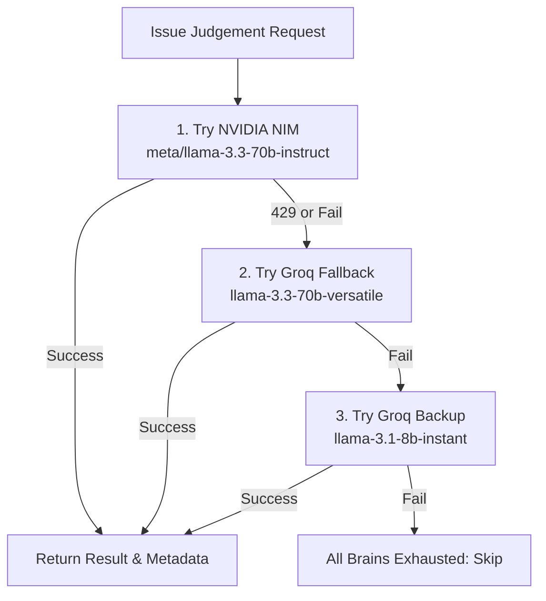

# GitNova V3: Unified Senior-Grade Master Implementation Plan
*Role: Lead Asynchronous Software Architect & Multi-Agent Orchestrator*

Welcome to the definitive architectural plan for GitNova V3. This document outlines the end-to-end design, database migrations, retrieval algorithms, multi-provider LLM gateway, and quantitative evaluation suite. 

Every architectural choice is explained from first principles so you can justify them in any technical interview or system design review.

---

## 1. Architectural Foundations & First Principles

To build a high-performance code recommendation system, we must operate under strict system constraints:
*   **Database Budget:** Supabase Free Tier caps PostgreSQL database space at **500 MB**. 
*   **Execution Time:** GitHub Actions runs must complete within **90 minutes**.
*   **API Limits:** GitHub API permits **5,000 requests/hour** per token. Groq/NVIDIA NIM have strict concurrent request and token-per-minute (TPM) limits.

We address these constraints through a set of foundational architectural designs:

### 1.1 Vector Storage Optimization (pgvector vs. External Vector DBs)
Instead of adding external SaaS dependencies (e.g., Pinecone, Qdrant) which introduce network overhead, egress costs, and credential complexity, we utilize **Supabase pgvector**. 
*   **Dimensionality and Model Selection:** We use the local `jinaai/jina-embeddings-v2-base-code` model. It produces **384-dimensional** embeddings (specifically optimized for code syntax) instead of heavy 1536-dimensional models.
*   **Storage Calculations:** A 384-float vector occupies $384 \times 4 \text{ bytes} \approx 1.54 \text{ KB}$ of raw storage. With database page headers and indices, this is approximately $2.5 \text{ KB}$ per chunk. Capping repository indexing at **25 files** (average 10 chunks per file) consumes only $\approx 625 \text{ KB}$ per repository snapshot. A database limit of 500 MB easily stores up to **500 active repository snapshots** alongside issue history and metadata.

### 1.2 The "Simple" Parser configuration for Code Full-Text Search (FTS)
PostgreSQL standard Full-Text Search uses the `english` search dictionary by default. This configuration applies standard English stemmers (e.g., converting `running` to `run`, or `classes` to `class`).
> [!IMPORTANT]
> **Why we use the `'simple'` dictionary configuration:**
> For code search, English stemming is highly destructive. A class named `UserManager` must not be matched with `UserManage`, and `date_formatter` must not be stemmed to `date_format`. The `simple` configuration splits tokens strictly by whitespace and non-alphanumeric characters, converting them to lowercase without applying any grammatical stemmers. This preserves exact code identifiers, method names, and file paths.

### 1.3 State Isolation & Immutable Snapshots
To prevent database corruption during failed repository indexing runs:
1. All newly chunked and embedded files are written to a snapshot marked `STAGING`.
2. Only when the entire repository has been successfully processed does an atomic transaction demote the old `ACTIVE` snapshot and promote the new one.
3. If the pipeline crashes midway, the database remains in a consistent state: the old snapshot is still `ACTIVE`, and the partial `STAGING` snapshot is cleaned up.

---

## 2. Target Outcomes and Service Level Objectives (SLOs)

We measure the success of V3 against concrete metric goals:

| Metric | Target | Rationale |
| :--- | :--- | :--- |
| **Idempotency** | 100% | Re-running a GitHub Action on the same commit SHA must make 0 database insertions and 0 embedding model calls. |
| **Retrieval Recall** | $\ge 80\%$ | The hybrid search must return the correct target file in its top 10 results for at least 80% of testing scenarios. |
| **File F1-Score** | $\ge 70\%$ | The harmonic mean of LLM file precision and recall must exceed 70% (no hallucinated files or missed modifications). |
| **Abstention Rate** | Correct | The model must output `INSUFFICIENT_CONTEXT` rather than guessing when search results are blank or irrelevant. |
| **Storage Cap** | < 400 MB | Eviction procedures must automatically purge old snapshot chunks to keep Supabase storage safely under the free limit. |

---

## 3. Current System Status

Before moving forward, we review the exact implementation status of our codebase:

*   **[`requirements.txt`](file:///c:/gitNova/backend/requirements.txt):** **Implemented.** Configured with pinned `transformers<5.0.0` to resolve `find_pruneable_heads_and_indices` compatibility issues with Jina code models, `sentence-transformers` for local embedding generation, and `pytest` for pipeline tests.
*   **[`github_client.py`](file:///c:/gitNova/backend/app/pipeline/github_client.py):** **Implemented.** Manages HTTP connection pooling, ETag conditional headers (avoiding API quota usage for unchanged files), and retry-after logic.
*   **[`code_indexer.py`](file:///c:/gitNova/backend/app/pipeline/code_indexer.py):** **Implemented.** Limits index scope to 25 files using structural priorities and keywords. Automatically parses Python files into logical AST components (classes, methods), and uses a language-agnostic sliding-window fallback (`_chunk_generic_code`) for non-Python repositories.
*   **[`code_retriever.py`](file:///c:/gitNova/backend/app/pipeline/code_retriever.py):** **Implemented.** Implements hybrid cosine-vector search and FTS-lexical search. Merges results using Reciprocal Rank Fusion (RRF), filters duplicates, and enforces file diversity rules.
*   **[`main.py`](file:///c:/gitNova/backend/app/main.py):** **Implemented.** Connects repository indexing to grounding pipelines, executes retrievers, and writes telemetry logs to Supabase.
*   **[`evaluate_pipeline.py`](file:///c:/gitNova/backend/scripts/evaluate_pipeline.py):** **Implemented.** Runs offline evaluation of golden dataset scenarios, reporting Retrieval Recall, MRR, and LLM F1-scores.
*   **[`bot.py`](file:///c:/gitNova/backend/app/pipeline/bot.py):** **Staged / In-Progress.** Feeds code chunks into prompt templates and enforces strict citation structures. **Needs primary NVIDIA NIM adapter and secondary Groq fallback gateway implementation.**
*   **Database Schema:** **Applied.** PostgreSQL tables, RRF procedures, and transaction management scripts have been successfully executed in the Supabase instance.

---

## 4. Multi-Provider LLM Gateway: Simplified Ordered Fallback Cascade

To bypass Groq rate-limiting constraints on the large 70B model, we implement a multi-provider fallback cascade in `bot.py`. Instead of an over-engineered circuit breaker state machine (which is overkill for low-volume action runs), we use a clean ordered fallback queue.



### 4.1 Model Configuration Mappings
1.  **Primary Provider:** **NVIDIA NIM**
    *   **Endpoint:** `https://integrate.api.nvidia.com/v1` (OpenAI-Compatible protocol)
    *   **Model:** `meta/llama-3.3-70b-instruct`
    *   **Env Variable:** `NVIDIA_API_KEY`
2.  **Fallback Provider:** **Groq (Large)**
    *   **Model:** `llama-3.3-70b-versatile`
    *   **Env Variable:** `GROQ_API_KEY`
3.  **Emergency Provider:** **Groq (Fast)**
    *   **Model:** `llama-3.1-8b-instant`
    *   **Env Variable:** `GROQ_API_KEY`

### 4.2 Return Signatures
The `evaluate_and_enrich` function will return `(response_json_str, provider_name, model_name)`. If a model call succeeds, the name of the provider and the exact model name are returned alongside the response so that the parent pipeline can write accurate metadata to the database.

---

## 5. Active Technical Deficiencies & Resolving Actions

Before deploying this upgrade, we must address the following active flaws in our setup:

> [!WARNING]
> ### 5.1 The "Fake" Evaluation Harness (`evaluate_pipeline.py`)
> *   **Deficiency:** The evaluation script uses a hardcoded "Golden Dataset" that points to external repos (`pandas-dev/pandas`, `pytorch/pytorch`, `fastapi/fastapi`) which are not indexed in our Supabase instance.
> *   **Consequence:** The script falls back to a dummy `"mock_commit_sha_for_testing"` string. Search returns `[]` empty results, resulting in a **0.00 score** across the board.
> *   **Resolution:** We will rewrite the evaluation script to target our own active workspace repository (`sriharizz/gitnova`) and define real test scenarios testing for files like `bot.py`.

> [!WARNING]
> ### 5.2 No Workspace Repository Snapshot
> *   **Deficiency:** We have never run the indexer on our own repository (`sriharizz/gitnova`).
> *   **Consequence:** Even if we point the evaluation script to `sriharizz/gitnova`, the database contains no chunks, causing search to return empty.
> *   **Resolution:** We will execute a real indexing run on Sriharizz/gitnova to generate an active vector and FTS snapshot in Supabase before evaluating.

> [!WARNING]
> ### 5.3 Hardcoded Telemetry in `main.py`
> *   **Deficiency:** `main.py` hardcodes the database writes as `model_provider: "groq"` and `model_name: "llama-3.3-70b-versatile"`.
> *   **Consequence:** If the gateway falls back to a smaller model or calls NVIDIA NIM successfully, the Supabase logs will falsely record Groq 70B, skewing system observability.
> *   **Resolution:** Update `main.py` to capture and store the dynamic `provider` and `model` values returned by the updated `bot.py` gateway.

---

## 6. Verification Roadmap

We will test our updates systematically without rushing, moving only when the previous stage is verified:

```
[Local Code Verification] ──> [Local Smoke Integration Test] ──> [Quantitative RAG Evaluation]
```

### 6.1 Step 1: Local Code Verification
We run pytest to verify syntax, imports, and existing tests pass:
```powershell
cd backend
.\env\Scripts\pytest
```

### 6.2 Step 2: Local Smoke Integration Test
We run a subset pipeline run using `main.py` to ensure:
*   The OpenAI client wrapper initializes properly with `NVIDIA_API_KEY`.
*   The LLM successfully returns the correct JSON formatting structure.
*   The dynamically returned metadata (`provider_name`, `model_name`) is logged accurately.

### 6.3 Step 3: Quantitative RAG Evaluation
Once local integration is confirmed, we will execute the evaluation script to ensure that the fallback cascade produces valid, highly aligned recommendations:
```powershell
$env:PYTHONIOENCODING="utf-8"
.\env\Scripts\python scripts/evaluate_pipeline.py
```
*(Note: LangSmith is not used in this environment as we do not have an active LangSmith API key or client setup. We rely fully on our quantitative `evaluate_pipeline.py` script.)*
